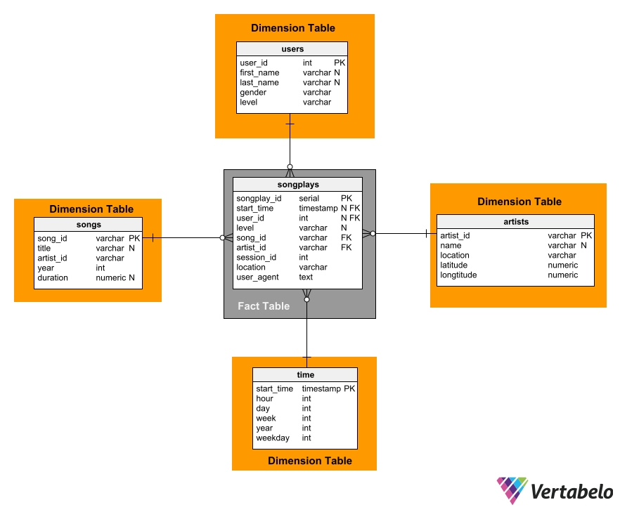
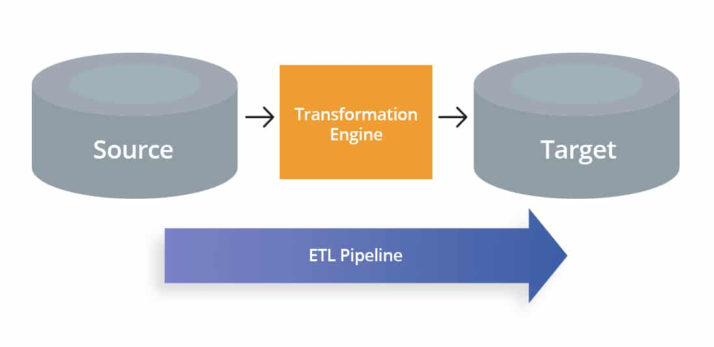

# Project: Data Modeling with Postgres

## Introduction
A startup called Sparkify wants to analyze the data they've been collecting on songs and user activity on their new music streaming app. The analytics team is particularly interested in understanding what songs users are listening to. Currently, they don't have an easy way to query their data, which resides in a directory of `JSON logs` on user activity on the app, as well as a directory with `JSON metadata` on the songs in their app.

They'd like a data engineer to create a Postgres database with tables designed to optimize queries on song play analysis, and bring you on the project. My role is to create a database schema and ETL pipeline for this analysis. I'll be able to test my database and ETL pipeline by running queries given to me by the analytics team from Sparkify and compare my results with their expected results.

## Project Description
In this project, I've apply what I've learned on data modeling with Postgres and build an ETL pipeline using Python & SQL. To complete the project, I define fact and dimension tables for a star schema for a particular analytic focus, and write an ETL pipeline that transfers data from files in two local directories into these tables in Postgres using Python and SQL.

## Source Data
## Song Dataset
The first dataset is a subset of real data from the [Milllion Song Dataset](https://labrosa.ee.columbia.edu/millionsong/). Each file is in JSON format and contains metadata about a song and the artist of that song. The files are partitioned by the first three letters of each song's track ID. For example, here are filepaths to two files in this dataset.

### directory path
```bash
song_data/A/B/C/TRABCEI128F424C983.json
song_data/A/A/B/TRAABJL12903CDCF1A.json
```

### Example
```json
{
    "num_songs": 1,
    "artist_id": "ARJIE2Y1187B994AB7",
    "artist_latitude": null, 
    "artist_longitude": null, 
    "artist_location": "", 
    "artist_name": "Line Renaud", 
    "song_id": "SOUPIRU12A6D4FA1E1",
    "title": "Der Kleine Dompfaff", 
    "duration": 152.92036, 
    "year": 0
}
```

## Log Dataset
The second dataset consists of log files in `JSON` format generated by this [event simulator](https://github.com/Interana/eventsim) based on the songs in the dataset above. These simulate activity logs from a music streaming app based on specified configurations.

The log files in the dataset are partitioned by year and month. For example, here are filepaths to two files in this dataset.

```bash
log_data/2018/11/2018-11-12-events.json
log_data/2018/11/2018-11-13-events.json
```

## Example


## Schema
Given the results from `explore_data.ipynb`, Ive created a star schema.





## ETL Pipeline

ETL stands for **E**xtract, **T**ransform and **L**oad.
An ETL Pipeline refrerts to a set of processes extractin data from an input source (`JSON files`), transforming the data, and loating into an output destination such as a database. 



## Steps
## Create tables
```bash
python create_tables.py
```
`create_tables.py` creates emplty tables with coresponing columns that are refrence in `sql_queries.py`, also it will delete tables if they are already created.


# ETL process
```bash
python etl.py
```
`etl.py` develops the process for each table, extracting the data from its two sources [song_data,log_data], transforming it from raw data, and load it to its coresponing database table.

## Examples


#### Show all artist from Texas
```sql
SELECT *
FROM artists
WHERE location LIKE '%TX%';
```


#### Show all the users with last name `Smith`
```sql
SELECT *
FROM users
WHERE last_name LIKE '%Smith%';
```


## Files
1. `test.ipynb` displays the first few rows of each table to let you check your database.
2. `create_tables.py` drops and creates your tables. You run this file to reset your tables before each time you run your ETL scripts.
3. `etl.ipynb` reads and processes a single file from song_data and log_data and loads the data into your tables. This notebook contains detailed instructions on the ETL process for each of the tables.
4. `etl.py` reads and processes files from song_data and log_data and loads them into your tables. You can fill this out based on your work in the ETL notebook.
5. `sql_queries.py` contains all your sql queries, and is imported into the last three files above.
6. `explore_data.ipynb` explores data from `log_data` and `song_data` to find best way to delcare columns based on coresponding data.
7. `README.md` provides discussion on your project.